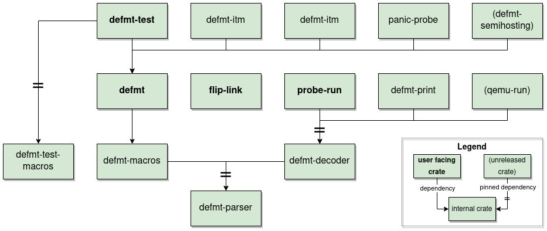

# `defmt`

`defmt` ("de format", short for "deferred formatting") is a highly efficient logging framework that targets resource-constrained devices, like microcontrollers.

For more details about the framework check the book at <https://defmt.ferrous-systems.com>.

The git version of the defmt book can be viewed at <https://defmt-next.ferrous-systems.com/>.

## Setup

### New project

The fastest way to get started with `defmt` is to use our [app-template] to set up a new Cortex-M embedded project.

[app-template]: https://github.com/knurling-rs/app-template

### Existing project

To include `defmt` in your existing project, follow our [Application Setup guide].

[Application Setup guide]: https://defmt.ferrous-systems.com/setup.html

## MSRV
`defmt` always compiles on the [latest `stable` rust release](https://github.com/rust-lang/rust/releases/latest). This is enforced by our CI building and testing against this version.

It still might work on older rust versions, but this isn't ensured.

## defmt ecosystem

The following diagram illustrates the user-facing and internal crates of the defmt framework.



## Developer Information

### Running Tests

Tests are run using `cargo xtask` -- although this is simply an alias (defined in `.cargo/config.toml`) for `cargo run --package xtask --`.

To see a list of options, see [`xtask/src/main.rs`](xtask/src/main.rs), or run:

```console
$ cargo xtask help
```

For example, to run all the tests, run:

```console
$ cargo xtask test-all
```

You will need `qemu-system-arm` installed and in your `$PATH` for some of the tests (e.g. `test-snapshot`).

## Support

`defmt` is part of the [Knurling] project, [Ferrous Systems]' effort at
improving tooling used to develop for embedded systems.

If you think that our work is useful, consider sponsoring it via [GitHub
Sponsors].

## License

Licensed under either of

- Apache License, Version 2.0 ([LICENSE-APACHE](LICENSE-APACHE) or
  http://www.apache.org/licenses/LICENSE-2.0)

- MIT license ([LICENSE-MIT](LICENSE-MIT) or http://opensource.org/licenses/MIT)

at your option.

### Contribution

Unless you explicitly state otherwise, any contribution intentionally submitted
for inclusion in the work by you, as defined in the Apache-2.0 license, shall be
licensed as above, without any additional terms or conditions.

[Knurling]: https://knurling.ferrous-systems.com/
[Ferrous Systems]: https://ferrous-systems.com/
[GitHub Sponsors]: https://github.com/sponsors/knurling-rs
