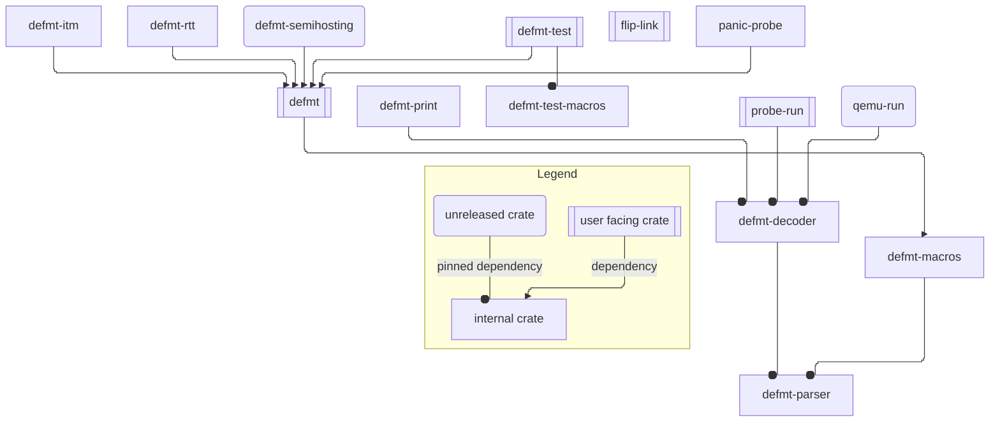

# `defmt`

`defmt` ("de format", short for "deferred formatting") is a highly efficient logging framework that targets resource-constrained devices, like microcontrollers.

For more details about the framework check the book at <https://defmt.ferrous-systems.com>.

## Components

This repository contains the following packages:

| Name                | Path                                                           | Description                                                                |
| ------------------- | -------------------------------------------------------------- | -------------------------------------------------------------------------- |
| `defmt`             | [`./defmt`](./defmt)                                           | On-target code for highly efficient logging                                |
| `defmt-macros`      | [`./macros`](./macros)                                         | Proc Macros for `defmt`                                                    |
| `defmt-print`       | [`./print`](./print)                                           | CLI utility for decoding and printing `defmt` encoded logs to standard out |
| `defmt-decoder`     | [`./decoder`](./decoder)                                       | Host Library for decoding `defmt` log frames                               |
| `defmt-parser`      | [`./parser`](./parser)                                         | Host Library for parsing `defmt` log frames                                |
| `defmt-rtt`         | [`./firmware/defmt-rtt`](./firmware/defmt-rtt)                 | On-target library for sending `defmt` logs over RTT                        |
| `defmt-itm`         | [`./firmware/defmt-itm`](./firmware/defmt-itm)                 | On-target library for sending `defmt` logs over ITM                        |
| `defmt-semihosting` | [`./firmware/defmt-semihosting`](./firmware/defmt-semihosting) | On-target library for sending `defmt` logs over semihosting                |
| `panic-probe`       | [`./firmware/panic-probe`](./firmware/panic-probe)             | On-target library for sending `panic!` over `defmt`                        |
| `defmt-test`        | [`./firmware/defmt-test`](./firmware/defmt-test)               | Framework for running tests on-target                                      |
| `defmt-test-macros` | [`./firmware/defmt-test/macros`](./firmware/defmt-test/macros) | Proc Macros for `defmt-test`                                               |
| `defmt-json-schema` | [`./defmt/defmt-json-schema`](./defmt/defmt-json-schema)       | Describes the JSON emitted by `defmt-decoder`                              |



## MSRV

The minimum supported Rust version is 1.76 (or Ferrocene 24.05). `defmt` is tested against the latest stable Rust version and the MSRV.

## Developer Information

### Running Tests

Tests are run using `cargo xtask` -- although this is simply an alias (defined in `.cargo/config.toml`) for `cargo run --package xtask --`.

To see a list of options, see [`xtask/src/main.rs`](xtask/src/main.rs), or run:

```console
cargo xtask help
```

For example, to run all the tests, run:

```console
cargo xtask test-all
```

You will need `qemu-system-arm` installed and in your `$PATH` for some of the tests (e.g. `test-snapshot`).

## Support

`defmt` is part of the [Knurling] project, [Ferrous Systems]' effort at
improving tooling used to develop for embedded systems.

If you think that our work is useful, consider sponsoring it via [GitHub
Sponsors].

## License

Licensed under either of

- Apache License, Version 2.0 ([LICENSE-APACHE](LICENSE-APACHE) or
  http://www.apache.org/licenses/LICENSE-2.0)

- MIT license ([LICENSE-MIT](LICENSE-MIT) or http://opensource.org/licenses/MIT)

at your option.

### Contribution

Unless you explicitly state otherwise, any contribution intentionally submitted
for inclusion in the work by you, as defined in the Apache-2.0 license, shall be
licensed as above, without any additional terms or conditions.

[Knurling]: https://knurling.ferrous-systems.com/
[Ferrous Systems]: https://ferrous-systems.com/
[GitHub Sponsors]: https://github.com/sponsors/knurling-rs
