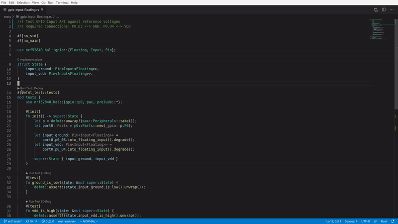

# `defmt-test`

`defmt-test` is a test harness for embedded devices that lets you write and run unit tests *on your device* as if you were using the built-in `#[test]` attribute.

It is compatible with [Rust-Analyzer]'s `▶Run` button, which means you can flash and run your tests straight from VSCode:



For a full list of defmt-test's capabilities, please refer to the documentation below.

[Rust-Analyzer]: https://rust-analyzer.github.io

## Basic usage

0. If you don't have a project setup yet, start from the [`app-template`], then proceed with step 3. If you have a project based on an old version of `app-template` then proceed with step 1.

[`app-template`]: https://github.com/knurling-rs/app-template

1. In the **testsuite** crate, add `defmt-test` to the dependencies:

``` diff
 # testsuite/Cargo.toml

 [dependencies]
+ defmt-test = "0.1.0"
```

2. Within the `testsuite/tests/test.rs` file, create a `tests` module and mark it with the `#[defmt_test::tests]` attribute. Within that module write `std`-like unit tests: functions marked with the `#[test]` attribute.

``` rust
// testsuite/tests/test.rs

#[defmt_test::tests]
mod tests {
    #[test]
    fn assert_true() {
        assert!(true)
    }

    #[test]
    fn assert_false() {
        assert!(false, "TODO: write actual tests")
    }
}
```

3. Run `cargo test -p testsuite` to run the unit tests

``` console
$ cargo test -p testsuite
(..)
0.000000 INFO  (1/2) running `assert_true`...
└─ test::tests::__defmt_test_entry @ tests/test.rs:7
0.000001 INFO  (2/2) running `assert_false`...
└─ test::tests::__defmt_test_entry @ tests/test.rs:7
0.000002 ERROR panicked at 'TODO: write actual tests', testsuite/tests/test.rs:16:9
└─ panic_probe::print_defmt::print @ (..omitted..)
stack backtrace:
   0: HardFaultTrampoline
      <exception entry>
   1: __udf
   2: cortex_m::asm::udf
        at (..omitted..)
   3: rust_begin_unwind
        at (..omitted..)
   4: core::panicking::panic_fmt
        at (..omitted..)
   5: core::panicking::panic
        at (..omitted..)
   6: test::tests::assert_false
        at tests/test.rs:16
   7: main
        at tests/test.rs:7
   8: ResetTrampoline
        at (..omitted..)
   9: Reset
        at (..omitted..)
```

NOTE unit tests will be executed sequentially

## Adding state

An `#[init]` function can be written within the `#[tests]` module.
This function will be executed before all unit tests and its return value, the test suite *state*, can be passed to unit tests as an argument.

``` rust
// state shared across unit tests
struct MyState {
    flag: bool,
}

#[defmt_test::tests]
mod tests {
    #[init]
    fn init() -> super::MyState {
        // state initial value
        super::MyState {
            flag: true,
        }
    }

    // this unit test doesn't access the state
    #[test]
    fn assert_true() {
        assert!(true);
    }

    // but this test does
    #[test]
    fn assert_flag(state: &mut super::MyState) {
        assert!(state.flag)
    }
}
```

``` console
$ cargo test -p testsuite
0.000000 INFO  (1/2) running `assert_true`...
└─ test::tests::__defmt_test_entry @ tests/test.rs:11
0.000001 INFO  (2/2) running `assert_flag`...
└─ test::tests::__defmt_test_entry @ tests/test.rs:11
0.000002 INFO  all tests passed!
└─ test::tests::__defmt_test_entry @ tests/test.rs:11
```

## Test Outcome

Test functions may either return `()` and panic on failure, or return any other type that implements the `TestOutcome` trait, such as `Result`.

This allows tests to indicate failure via `Result`, which allows using the `?` operator to propagate errors.

Similar to Rust's built-in `#[should_panic]` attribute, `defmt-test` supports a `#[should_error]` attribute, which inverts the meaning of the returned `TestOutcome`.
`Err` makes the test pass, while `Ok`/`()` make it fail.

## Support

`defmt-test` is part of the [Knurling] project, [Ferrous Systems]' effort at
improving tooling used to develop for embedded systems.

If you think that our work is useful, consider sponsoring it via [GitHub
Sponsors].

## License

Licensed under either of

- Apache License, Version 2.0 ([LICENSE-APACHE](LICENSE-APACHE) or
  http://www.apache.org/licenses/LICENSE-2.0)

- MIT license ([LICENSE-MIT](LICENSE-MIT) or http://opensource.org/licenses/MIT)

at your option.

### Contribution

Unless you explicitly state otherwise, any contribution intentionally submitted
for inclusion in the work by you, as defined in the Apache-2.0 license, shall be
licensed as above, without any additional terms or conditions.

[Knurling]: https://knurling.ferrous-systems.com
[Ferrous Systems]: https://ferrous-systems.com/
[GitHub Sponsors]: https://github.com/sponsors/knurling-rs
